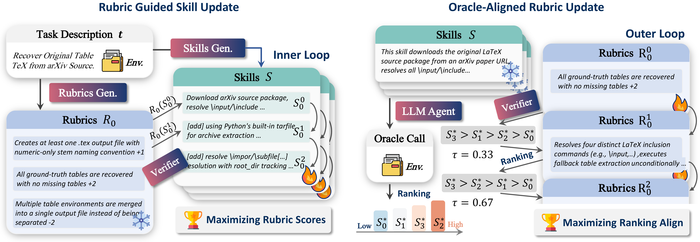
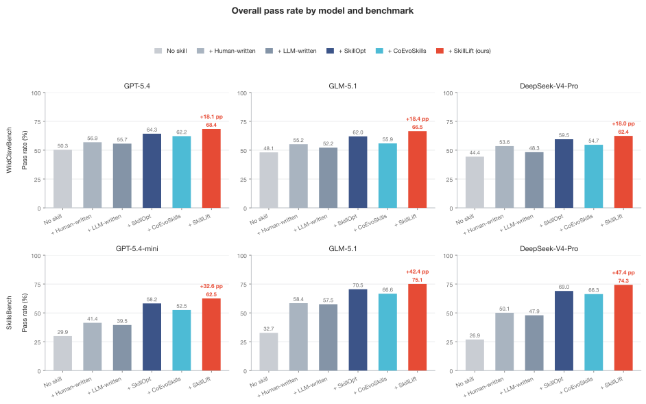
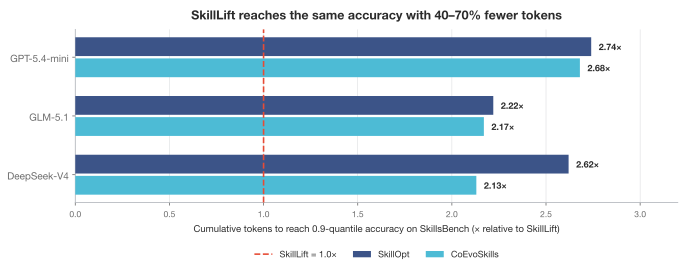
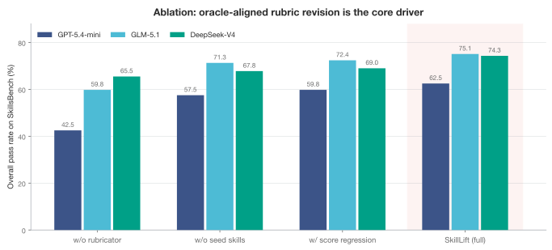
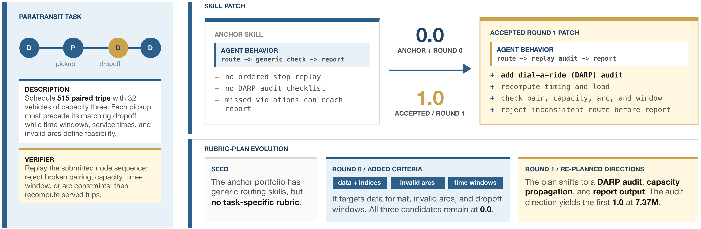
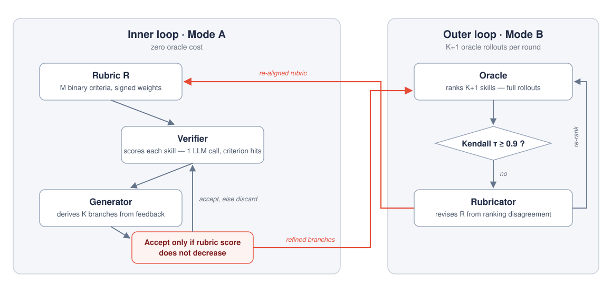

<div align="center">

# SkillLift

**Rubric-guided self-evolution of agent skills — dense verifier feedback, sparse oracle cost.**

[](LICENSE)
[](https://www.python.org/downloads/)
[](https://www.docker.com/)
[](#results)



**SkillLift wins all six model × benchmark combinations**, lifting the one-shot skill ceiling by
**+8.8–11.5 pp** on WildClawBench and **+16.7–24.2 pp** on SkillsBench, while baselines need
**2.1–2.7× more tokens** to reach the same accuracy.

[Highlights](#why-skilllift) · [Results](#results) · [How it works](#how-it-works) · [Installation](#installation) · [Configuration](#configuration) · [Quickstart](#quickstart) · [Methods](#supported-methods) · [Structure](#project-structure)

</div>

## Why SkillLift?

Agent skills — reusable procedural prompts loaded before task execution — let a frozen LLM agent
adapt without weight updates. But every quality judgment on a skill costs a **full agent rollout**
(an *oracle call*), so existing self-evolution methods can afford only a handful of evaluations and
collapse into conservative failure-patching.

SkillLift breaks this supervision bottleneck with one idea: **ranking is a cheaper supervision
target than score regression.** Instead of chasing oracle scores directly, SkillLift first learns a
*rubric* — a set of binary criteria with signed weights — that reproduces the oracle's *preference
order* over skills. Once aligned, the rubric scores any candidate with a **single LLM call**, giving
the skill generator dense, criterion-level feedback at zero oracle cost.

| Method | Evolves | Surrogate | Dense feedback | Oracle calls |
|---|:-:|:-:|:-:|:-:|
| Trace2Skill | ✗ | ✗ | ✗ | O(1) |
| MUSE-Autoskill | ✓ | ✗ | ✗ | O(L·T) |
| SkillOpt | ✓ | ✗ | ✗ | O(L·T) |
| CoEvoSkills | ✓ | ✓ | ✓ | O(L·T) |
| **SkillLift** | ✓ | ✓ | ✓ | **O(L)** |

## Results

Evaluation covers **147 tasks**: [WildClawBench](https://github.com/InternLM/WildClawBench)
(60 bilingual, multimodal tasks in 6 categories, real OpenClaw CLI harness in Docker) and
[SkillsBench](https://github.com/benchflow-ai/skillsbench) (87 tasks across 8 domains, OpenHands
harness, deterministic verifiers), with three backbones — GPT-5.4(-mini), GLM-5.1, and
DeepSeek-V4-Pro. All evolving methods start from identical seed skills; baselines receive **2×
SkillLift's token budget**. Scores are mean per-task best evolved-skill pass rates over 3 rollout
seeds with early stopping after 2 stagnant rounds.

<div align="center">

</div>

Across all six model × benchmark combinations SkillLift delivers the top overall pass rate, with
the largest jumps on SkillsBench where deterministic verifiers give crisp oracle signal.

<div align="center">

</div>

On SkillsBench, reaching the 0.9-quantile accuracy costs SkillOpt **2.13–2.74×** and CoEvoSkills
**2.13–2.68×** the tokens SkillLift spends — a **40–70% saving** that comes from the O(L) oracle
complexity: rubric scoring in the inner loop is one LLM call, not a rollout.

Gains are largest where correctness is verifiable. On GLM-5.1, Search jumps **40.9% → 75.0%**
(+34.1 pp) on WildClawBench and Network Security **36.8% → 92.9%** (+56.1 pp) on SkillsBench,
while subjective Creative writing stays nearly flat — binary rubric criteria mirror the
deterministic verifier wherever verification exists.

<div align="center">

</div>

**Ablations confirm the mechanism.** Removing oracle-aligned rubric revision collapses pass rates
to within +1.4 pp of the static-skill baseline; replacing ranking-based alignment with direct score
regression costs 3–5 pp at identical oracle budget — absolute oracle scores are noisy and
non-comparable across tasks, ordinal information is not.

### Case study

One SkillsBench task traces the full loop: paratransit scheduling with 515 paired trips and 32
vehicles. The seed skill scores **0.0** — it never replays the planned stops. Round 0's rubric
adds surface-level criteria (data format, invalid arcs, dropoff windows) and all candidates still
score 0.0; the oracle ranking exposes the misalignment, the rubricator re-plans toward a
dial-a-ride audit, and Round 1's accepted patch reaches **1.0** at 7.37M tokens.

<div align="center">

</div>

All numbers above are checked in with the repository — they live in the `RESULTS` dict of
[`scripts/plot_readme_figures.py`](scripts/plot_readme_figures.py); see
[Regenerating the figures](#regenerating-the-figures).

## How it works

SkillLift solves skill evolution as a **bilevel optimization** via alternating updates:

<div align="center">

</div>

- **Inner loop (Mode A):** the frozen rubric guides skill revision. Each branch is refined only
  while its rubric score is non-decreasing, so local refinement can never degrade a candidate.
- **Outer loop (Mode B):** K+1 oracle rollouts rank the champion and the refined branches; a
  *rubricator* revises the rubric until its ranking agrees with the oracle's (Kendall's τ ≥ 0.9).
  A misaligned rubric degrades guidance quality, never the final output — the champion is always
  selected by oracle score.
- **Bounded edits:** every skill revision is applied as a validated unified diff through the
  [`bounded-edits`](packages/bounded-edits/) engine — no uncontrolled rewrites.

The flagship algorithm (`skilllift`) is realized as the portfolio coordinator: each task starts
from the seed skill portfolio the benchmark task declares, then runs the locked protocol above
under fully auditable per-round records. The same CLI runs every baseline so all methods are
compared under identical budgets.

## Installation

Requirements: Python **3.11+** (tested on 3.13), Docker, and the benchmark submodules.

```bash
git clone --recurse-submodules <this-repo-url>
cd SkillLift

python -m venv .venv && source .venv/bin/activate
pip install -r skilllift/requirements.txt
pip install -e skilllift/
pip install -e packages/bounded-edits

cp .env.example .env   # then fill in your endpoints and keys
```

> tau2-bench runs additionally read `tau2-bench/.env` — create it with the same
> provider/judge variables you plan to use for tau2 evaluation.

See [Configuration](#configuration) for endpoints, per-benchmark setup, and algorithm knobs.

## Configuration

**1 · Model endpoints.** Everything is environment-driven — no keys in code. Each provider is a
triplet in `.env` (copy `.env.example`), e.g. `GLM_MODEL` / `GLM_BASE_URL` / `GLM_API_KEY`. The
label you pass as `--model` selects an endpoint profile in
[`skilllift_eval/config.yaml`](skilllift_eval/config.yaml), which maps it to the env triplet:

```yaml
model_endpoints:
  glm-5.1:
    provider: openai-completions
    provider_model_id_env: GLM_MODEL
    base_url_env: GLM_BASE_URL
    api_key_env: GLM_API_KEY
    timeout_seconds: 300
    max_retries: 4
```

The same profile drives the agent, the judge, and all SkillLift framework modules, so one model
change reruns the whole comparison. A `stream: true` flag enables SSE token accounting.

**2 · Per-benchmark setup.**

| Benchmark | What it additionally needs |
|---|---|
| WildClawBench | Docker (one container per task; image via `DOCKER_IMAGE`, default `wildclawbench-ubuntu:v1.3`). Task definitions — env, seed skills, graders — are self-contained `WildClawBench/tasks/**.md`, no extra config. |
| SkillsBench | Its own venv (`skillsbench/.venv`) and Docker; per-domain launch settings in `configs/skillsbench/domains/*.yaml` (split, trials, thresholds, run roots). |
| tau2-bench | A `tau2-bench/.env` with the same provider/judge variables; select domains via `--tau2.domains`. |

**3 · Algorithm knobs.** Method parameters come from profiles in
`skilllift_eval/algorithm_params/<method>.paper_default.yaml`, selected with
`--param-profile`, and can be overridden one-off with `--algo-param key=value`. The SkillLift
defaults: rounds `L=3`, population `K=3`, inner/outer step caps `2/2`, verifier threshold
`θ_A=0.85`, rank-alignment `θ_B=0.9`, stop threshold `θ_stop=0.9`. Evaluation budget semantics
switch with `--evaluation-mode native_end_to_end|budget_matched`.

## Quickstart

Run the SkillLift (`skilllift`) pipeline on WildClawBench:

```bash
# single task
python -m skilllift_eval.cli run skilllift \
    --benchmark wildclawbench --model glm-5.1 \
    --config skilllift_eval/config.yaml --tasks.mode single --tasks.filter <task-id>

# or the batch driver (all six categories, resumable)
python scripts/skilllift_wildclaw_tasks.py --model glm-5.1 --run-root runs/skilllift_wildclaw_tasks --resume
```

Run a baseline on tau2-bench:

```bash
python -m skilllift_eval.cli run no_skill \
    --benchmark tau2 --model glm-5.1 \
    --config skilllift_eval/config.yaml --tau2.domains airline,retail,telecom
```

Run SkillsBench (requires `skillsbench/.venv` and Docker):

```bash
scripts/run_skillsbench.sh --model glm --domain software-engineering --baseline skilllift
```

Useful flags: `--dry-run`, `--evaluation-mode native_end_to_end|budget_matched`,
`--param-profile paper_default`, `--algo-param k=v`. Audit a finished run with
`python -m skilllift_eval.cli audit <run_root>`.

## Supported methods

| CLI name | What it does |
|---|---|
| `no_skill` | Raw agent without any skill (lower anchor) |
| `human_skill` | Benchmark-provided / practitioner-authored static skills |
| `autoskill` | One-shot LLM-written skills (static ceiling) |
| `textgrad` | Text-gradient style iterative skill refinement |
| `coevoskills` | Co-evolutionary generator–verifier loop |
| `skilllift` | **SkillLift** — rubric-guided bilevel evolution (this repo's method) |

## Benchmarks

| Benchmark | Tasks | Harness | Notes |
|---|:-:|---|---|
| [WildClawBench](https://github.com/WalteR-MittY-pro/WildClawBench) | 60 | OpenClaw CLI in Docker | 6 categories, bilingual, multimodal |
| [SkillsBench](https://github.com/WalteR-MittY-pro/skillsbench) | 87 | OpenHands | 8 domains, deterministic verifiers |
| [tau2-bench](https://github.com/WalteR-MittY-pro/tau2-bench) | — | τ-bench agent–user–tool | airline / retail / telecom |

The benchmark submodules are lightly patched forks of their upstreams (skill-injection hooks,
seed-skill declarations, harness hardening) required to run skill evolution end-to-end; see each
fork's git log for the exact deltas.

## Project structure

| Path | What it is |
|---|---|
| `skilllift_eval/` | Evaluation framework: CLI, runners for every baseline × benchmark pair, resume, token accounting |
| `skilllift/skilllift/` | Algorithm core: portfolio coordinator, Modes A/B, rubricator, verifier, oracle adapters |
| `packages/bounded-edits/` | Constrained unified-diff edit engine used for all skill revisions |
| `configs/` | Per-domain launch configs for SkillsBench runs (other benchmarks configure via `skilllift_eval/config.yaml` + CLI flags) |
| `assets/` | README figures (SVG artwork + generated charts) |
| `scripts/` | Batch drivers and per-benchmark launch scripts |
| `WildClawBench/`, `tau2-bench/`, `skillsbench/` | Benchmark submodules (tasks, skills, graders) |
| `skilllift/README.md` | Deep dive into the co-evolution loop, knobs, and artifacts |

## Regenerating the figures

The three data charts in this README are rendered from checked-in data — no screenshots:

```bash
pip install matplotlib
python scripts/plot_readme_figures.py   # writes assets/figures/*.svg
```

The method overview and case-study diagrams ship as high-resolution artwork under
`assets/figures/`.

## Tests

```bash
python -m pytest tests/skilllift_eval        # framework + runner contracts
cd skilllift && python -m pytest tests       # algorithm core
python -m pytest packages/bounded-edits/tests  # edit engine
```

## License

[MIT](LICENSE) — benchmark assets keep their upstream licenses in the respective submodules. If you
use SkillLift in your research, please cite this repository (see
[`CITATION.cff`](CITATION.cff)).

<div align="center">
<sub>If SkillLift is useful to you, consider giving it a star ⭐</sub>
</div>
