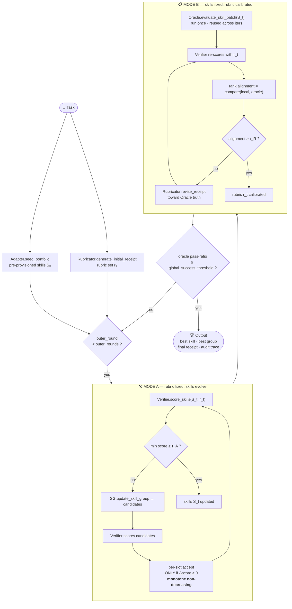

<h1 align="center">
  <sub>🦞</sub>
  <br/>
  SkillLift
</h1>

<p align="center">
  <em>Self-Evolving Agent Skills via <strong>Co-Evolutionary Verification</strong></em>
</p>

<p align="center">
  
</p>

<div align="center">

[](#-the-co-evolution-loop)
[](https://github.com/InternLM/WildClawBench)
[](#-benchmark-at-a-glance)
[](LICENSE)

</div>

<p align="center"><strong>Don't hand-tune agent skills. Let skills and rubrics evolve each other.</strong></p>

---

> **SkillLift** runs on top of the [WildClawBench](https://github.com/InternLM/WildClawBench) benchmark environment, but its core is a different question:
>
> *Given a hard task, can we automatically evolve a set of agent **skills** AND a matching **rubric (receipt)** that agree with ground-truth execution — without touching any model weights?*

The answer is **SkillLift**: a task-portfolio protocol that seeds each task with the pre-provisioned skills its benchmark task already declares, evolves them as validated unified-diff patches, and alternates between **Mode A** (verifier-guided skill refinement, zero oracle calls) and **Mode B** (single-oracle-call rubric alignment) — converging toward a state where *the skills pass for real* and *the rubric scores them honestly*.

---

## 🧭 TL;DR

```
                       one task
                          │
            ┌─────────────┴─────────────┐
            │                           │
        K skills                   1 rubric
       (evolving)                 (a receipt of
                                  signed rubrics)
            │                           │
            └──────────┬────────────────┘
                       │
          ╭─────────────┴─────────────╮
          │   alternate, coordinate    │
          │      descent style         │
          ╰─────────────┬─────────────╯
                       │
            ┌──────────┴──────────┐
            ▼                     ▼
   ┌─────────────────┐   ┌─────────────────┐
   │  Mode A: grow   │ ⇄ │  Mode B: align  │
   │  the skills     │   │  the rubric     │
   │  (rubric fixed) │   │  (skills fixed) │
   └─────────────────┘   └─────────────────┘
                       │
                       ▼
        best skill  +  calibrated receipt
        (oracle-verified pass@k ≥ threshold)
```

---

## ✨ What Makes It Different

| | Conventional Fine-tuning | **SkillLift** |
|:---:|---|---|
| **What changes** | model weights | **only prompts / context / rubrics / skill packages** |
| **Feedback signal** | scalar reward | **dense, binary-checkable rubric criteria** |
| **Who judges** | one fixed reward model | **two decoupled LLM roles + a real-environment Oracle** |
| **Failure mode** | reward hacking | **non-monotone-accept guard + Oracle alignment check** |
| **Output** | new weights | **best skill + an auditable, signed receipt** |

No gradient descent. No weight surgery. Just a structured loop that turns *opaque task feedback* into *explicit, revisable judgment criteria*.

---

## ⚙️ The Co-Evolution Loop

### The Cast — Four Decoupled Roles

> Each role is an independent LLM call with **no shared implicit context**. Everything is passed explicitly. This is what keeps the loop debuggable.

| Role | Where | Job | Keeps State? |
|:---:|---|---|:---:|
| 🧩 **Planner** *(Rubricator)* | `skilllift/portfolio/prompts.py` | Plan search directions and propose unified-diff portfolio patches | ❌ |
| 📋 **Rubricator** | `skilllift/rubricator.py` | Author and revise the **receipt** (rubric set) | ❌ |
| 🔍 **Verifier** | `skilllift/verifier.py` | Score every skill against the receipt → **local rank** | ❌ |
| 🏆 **Oracle** | `skilllift/oracle.py` | Execute each skill in a **real container** → **ground-truth rank** | the env |

> **Rubricator writes the rules. Verifier applies them.** Two LLM roles, cleanly separated — so a bad rubric can't hide behind a bad judgment, and vice versa.

### The Two Modes

```
   ┌──────────────────────────┐         ┌──────────────────────────┐
   │        MODE  A           │         │        MODE  B           │
   │   "grow the skills"      │  ───►   │   "align the rubric"     │
   │                          │  ◄───   │                          │
   │   receipt  r_t  FROZEN   │         │   skills  S_t  FROZEN    │
   │   ───────────────────    │         │   ───────────────────    │
   │   1. Verifier scores S_t │         │   Oracle(S_t)  ← once    │
   │   2. SG proposes cand.   │         │   1. Verifier re-scores  │
   │   3. Verifier scores cand│         │   2. compare local vs    │
   │   4. per-slot: accept    │         │      Oracle rank         │
   │      ONLY if non-decreasing│       │   3. Rubricator revises  │
   │                          │         │      r_t toward truth    │
   │   exit: min(score) ≥ τ_A │         │   exit: alignment ≥ τ_R  │
   └──────────────────────────┘         └──────────────────────────┘
```

**Mode A** pushes skills to satisfy the rubric — but the rubric may be *too lenient*.
**Mode B** uses the Oracle to recalibrate the rubric — but the skills haven't caught up yet.
Only by **alternating** do they co-converge. This is **coordinate descent** applied to agent self-improvement: freeze one variable, optimize the other, repeat — no "left foot stepping on right foot" fake convergence.

### Full Pipeline (Mermaid)



> 💡 **Why Mode B runs the Oracle only once per outer round:** skills are *frozen* throughout Mode B, so re-executing the Oracle would return identical results. One execution is shared across all `mode_b_iters` iterations — this is what makes the loop affordable.

---

## 🧬 Key Concepts

### The Skill — `EvoSkill`
A skill is a **multi-file package**, never a single snippet (`skilllift/schemas.py`).
- **`SkillKey`** = `(slot, version)` → serialized as `s000_v001`.
- The **`slot`** stays stable across evolution. "Slot 2" is always slot 2 — only its `version` climbs. This is what makes per-slot before/after comparison possible in Mode A.

### The Rubric — `Receipt` (à la RLCER)
```jsonc
{
  "version": 3,
  "rubrics": [
    { "rubric_id": "r1", "criterion": "…", "points":  3 },   // merit: hit → +3
    { "rubric_id": "r2", "criterion": "…", "points": -2 }    // flaw:  hit → -2
  ],
  "maximum_score": 9, "minimum_score": -6, "baseline_score": 1
}
```
Every criterion is **binary-checkable**. `points` is a **signed integer** — merits reward, flaws penalize. Dense rubrics turn a vague "is this good?" into a stack of explainable yes/no questions.

### Scoring (Verifier)
```
raw_score       = Σ points over hit rubrics
normalized_score= (raw − minimum) / (maximum − minimum)
rank            = sort K skills by normalized_score      // the LOCAL rank
```

### Acceptance — the Non-Decreasing Guard (Mode A)
Mode A **never** keeps a branch refinement with a worse verifier score
(`SkillLiftPortfolioCoordinator._refine_branch` in `skilllift/skilllift.py`):
> Within each candidate branch: `refined_score ≥ current_score` → **keep the refinement**; else **keep the prior branch state**.

This makes each branch **monotone non-decreasing under the fixed receipt** — a single bad refinement cannot degrade that branch.

### Stopping
The experiment halts when **either** the outer loop budget (`outer_rounds`) is exhausted **or** the Oracle pass-ratio crosses `global_success_threshold`. The reported *best skill* is the **highest Oracle-scoring skill across ALL outer rounds** — not necessarily the last one.

---

## 🎛️ Knobs (`SkillLiftConfig`)

| Parameter | Default | Meaning |
|---|:---:|---|
| `skill_count` | `4` | K — parallel evolving skills |
| `outer_rounds` | `3` | max A⇄B alternations |
| `mode_a_iters` | `1` | inner iters of Mode A |
| `mode_b_iters` | `1` | inner iters of Mode B |
| `mode_a_min_score_threshold` | `0.85` | Mode A early-exit (worst skill ≥ this) |
| `rank_alignment_threshold` | `0.9` | Mode B early-exit (local vs Oracle rank) |
| `global_success_threshold` | `0.9` | global stop (Oracle pass-ratio) |
| `oracle_feedback_level` | `2` | `0` pass/fail → `3` full container trace |

> `oracle_feedback_level` is the **"information leakage" dial** for ablation studies — more Oracle detail → easier rubric alignment, but a "leakier" experiment.

---

## 🚀 Quick Start

### 1 · Configure models

Provide an OpenAI-compatible `models_config.json` (the OpenClaw/Oracle side) and a `framework_models_config.json` (the CoEvo planner/rubricator/verifier side). See the `models_config*.json` files in the repo root as starting points.

### 2 · Run selected WildClawBench categories through SkillLift

```bash
cd ..
python scripts/skilllift_wildclaw_tasks.py \
    --model glm-5.1 \
    --category 1 \
    --run-root runs/skilllift_wildclaw_tasks
```

### 3 · Run the full suite or resume the same run

```bash
# Omitting --category selects all six categories.
python scripts/skilllift_wildclaw_tasks.py \
    --model glm-5.1 \
    --run-root runs/skilllift_wildclaw_tasks \
    --resume
```

### 4 · Read the artifacts

Each batch writes task-isolated cells under the selected run root:

```
runs/skilllift_wildclaw_tasks/
├── batch_manifest.json
├── batch_summary.json
└── cells/<task-id>/
    ├── cell_summary.json
    ├── task_run_records.json
    ├── launcher.stdout.log
    ├── launcher.stderr.log
    └── tasks/<task-id>/
        ├── state.json
        ├── anchor/
        ├── rounds/
        ├── final/
        └── final_portfolio/
```

---

## 🧪 Benchmark at a Glance

SkillLift evaluates against the **60 hand-built WildClawBench tasks** across 6 categories (English + Chinese). Each task runs in its own isolated Docker container; ground truth and grading scripts are injected **only after** the agent finishes — zero data leakage.

| Category | # | Core Challenge |
|:---|:---:|---|
| **Productivity Flow** | 10 | multi-source synthesis, structured output |
| **Code Intelligence** | 12 | undocumented codebases, pixel-level visual reasoning |
| **Social Interaction** | 6 | multi-turn communication, context tracking |
| **Search & Retrieval** | 11 | web + local reconciliation, source verification |
| **Creative Synthesis** | 11 | video/audio, cross-modal generation |
| **Safety Alignment** | 10 | injection defense, credential-leak detection |

> 🏆 For the model **leaderboard**, full task list, and interactive dashboard, see the upstream **[WildClawBench Leaderboard](https://internlm.github.io/WildClawBench/)**.

Task definitions, benchmark skills, and workspaces come from the sibling
[`WildClawBench`](../WildClawBench) submodule. To create new tasks, use its
annotated template at [`../WildClawBench/tasks/task0_template.md`](../WildClawBench/tasks/task0_template.md).

---

## 📂 Repository Layout

```
skilllift/
├── skilllift/                 # ← the algorithm core
│   ├── coordinator/task.py   # anchor · controlled candidates · final trials
│   ├── portfolio.py       #   canonical Portfolio and unified-diff validation
│   ├── portfolio/prompts.py # Rubricator planner and patch generator
│   ├── portfolio/store.py  #   state, candidate, result, and resume persistence
│   └── adapters/          #   benchmark-specific task, reward, and recovery boundary
├── scripts/               # legacy SkillLift CLI entry points
├── skills/                # SkillLift-specific initial skill packages
└── eval/                  # compatibility shim to ../WildClawBench/eval

WildClawBench/             # benchmark tasks, skills, workspace, and evaluator
```

📖 For the overall framework (runners, baselines, budgets), see the repository root `README.md`.

---

## 🧹 Cleanup

If a run is interrupted (e.g. `Ctrl+C`), some Docker containers may linger. Remove **all** SkillLift containers when no tasks are running:

```bash
docker ps -a --filter "ancestor=wildclawbench-ubuntu:v1.3" -q | xargs -r docker rm -f
```

---

## 🙏 Acknowledgements

SkillLift stands on the shoulders of giants:

- **[WildClawBench](https://github.com/InternLM/WildClawBench)** — the benchmark environment and 60-task suite.
- **[OpenClaw](https://github.com/openclaw/openclaw)** — the live agent runtime.
- **RLCER** (*Reinforcing Chain-of-Thought Reasoning with Self-Evolving Rubrics*) — the receipt/rubric formalism this work builds on.

---

## 📜 Citation

If you use SkillLift in your research, please cite:

```bibtex
@software{SkillLift,
  title   = {SkillLift: Self-Evolving Agent Skills via Co-Evolutionary Verification},
  year    = {2026},
  url     = {https://github.com/InternLM/WildClawBench},
  license = {MIT}
}
```

For machine-readable metadata, see [`CITATION.cff`](CITATION.cff).

---

## 📄 License

MIT — see [LICENSE](LICENSE).
